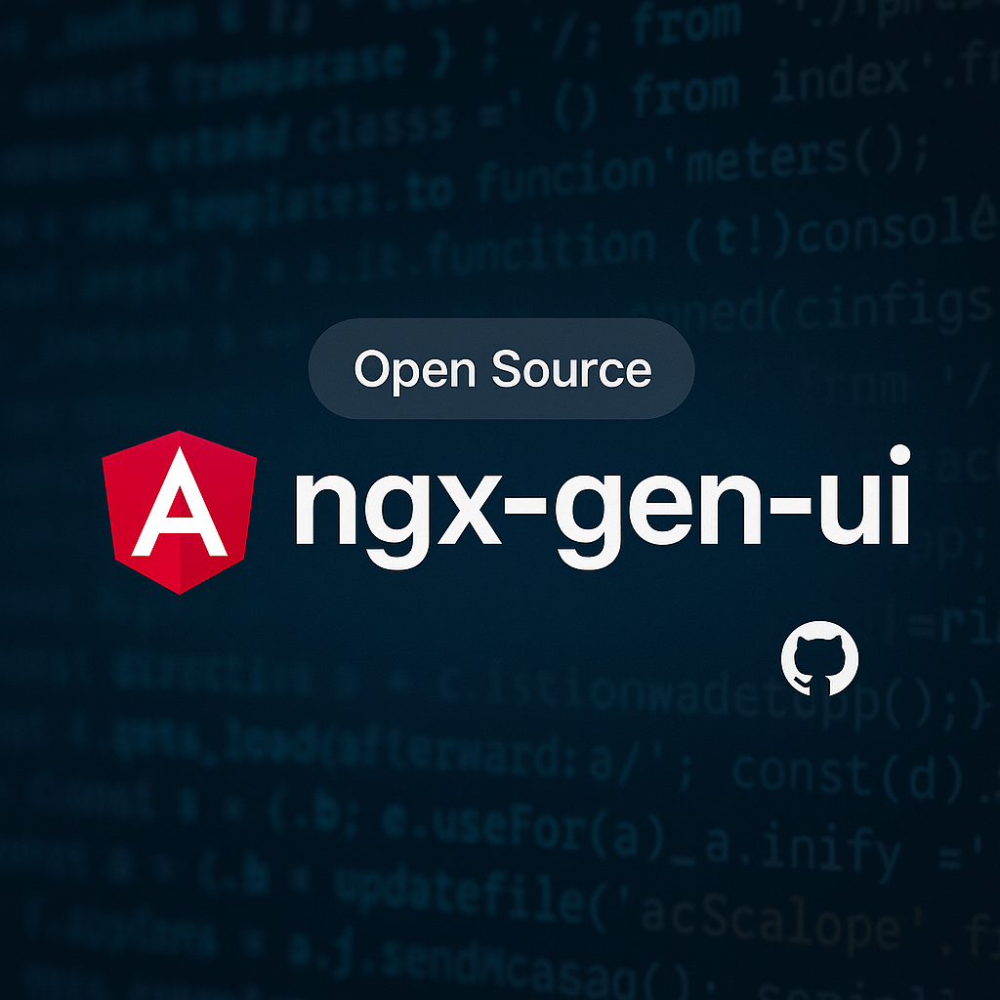

<p align="center">
  
</p>

<h1 align="center">ngx-gen-ui</h1>

<p align="center">
  Stream Firebase Vertex AI responses straight into Angular templates.
</p>

<p align="center">
  <a href="https://angular.dev/" target="_blank"><strong>Angular</strong></a> ·
  <a href="https://firebase.google.com/products/vertex-ai" target="_blank"><strong>Firebase Vertex AI</strong></a>
</p>

---

## Table of Contents
- [Overview](#overview)
- [Features](#features)
- [Quick Start](#quick-start)
- [Development](#development)
- [Contributing](#contributing)
- [License](#license)

---

## Overview

This monorepo ships two projects:

- `projects/ngx-gen-ui`: a publishable Angular library exposing `AiPromptDirective` and `AiService` for streaming Vertex AI content.
- `projects/demo`: a showcase app demonstrating different prompt scenarios using the library.

The library focuses on lightweight integration and reactive streaming, making it simple to drop AI-powered text into any Angular view.

---

## Features

- **Streamlined setup** — Add a directive, pass a prompt, watch content stream in real time.
- **Configurable generation** — Tweak models, temperature, and more via `GenerationConfig`.
- **Safe rendering** — Opt-in HTML rendering with guards for trusted content.
- **Structured responses** — Let the AI return structured markup (e.g. `["h1","Title"]`) and render it instantly.
- **Angular-first DX** — Works with standalone APIs and cancellation built in.

---

## Quick Start

### 1. Install dependencies

```bash
npm install ngx-gen-ui firebase @firebase/vertexai-preview
```

> `firebase` and `@firebase/vertexai-preview` are peer dependencies required by the service.

### 2. Provide Firebase + Vertex AI credentials

```ts
// app.config.ts (Angular 17+ standalone bootstrap)
import { ApplicationConfig, provideHttpClient } from '@angular/core';
import { provideAiPromptConfig } from 'ngx-gen-ui';

export const appConfig: ApplicationConfig = {
  providers: [
    provideHttpClient(),
    provideAiPromptConfig({
      firebaseOptions: {
        apiKey: 'YOUR_API_KEY',
        projectId: 'YOUR_PROJECT_ID',
        appId: 'YOUR_APP_ID',
        authDomain: 'YOUR_AUTH_DOMAIN'
      },
      model: 'gemini-2.0-flash' // optional, defaults to gemini-1.5-flash
    })
  ]
};
```

### 3. Apply the directive

```html
<p
  ai-prompt="Write a friendly welcome description for our SaaS homepage."
  [ai-generation]="{ temperature: 0.4 }"
  ai-stream
></p>
```

### 4. Generate structured UI fragments (optional)

Use the dedicated directive when you want the AI to respond with lightweight HTML instructions that the library renders for you.

```html
<div
  class="hero-preview"
  ai-structured-prompt="Design a short hero section for an Italian tech startup with a title, supporting sentence, and an image URL."
></div>
```

> The `ai-structured-prompt` directive automatically asks the AI for a JSON array like `[["h1","Title"],["p","Copy"],["img","/path.jpg","Alt"]]` and renders the DOM elements for you. Streaming is disabled in this mode to guarantee valid JSON.

**Supported bindings**

- `ai-prompt` / `aiPrompt`: prompt string.
- `[ai-generation]` / `[aiGeneration]`: partial `GenerationConfig` (temperature, model, etc.).
- `ai-stream` / `aiStream`: enable streaming updates.
- `ai-allow-html` / `aiAllowHtml`: render streamed HTML safely when you trust the source.

**Structured directive bindings**

- `ai-structured-prompt` / `aiStructuredPrompt`: prompt string.
- `[ai-structured-generation]` / `[aiStructuredGeneration]`: partial `GenerationConfig`.
- `ai-structured-allow-html` / `aiStructuredAllowHtml`: allow HTML in fallback rendering when the response is not valid structured data.

---

## Development

### Prerequisites
- Node.js 18+
- npm
- Firebase project with Vertex AI access (for the demo)

### Common scripts

```bash
npm install      # install dependencies
npm start        # run the demo app -> http://localhost:4200
npm run build    # build the demo app (dist/demo)
npm run build:lib  # build the library (dist/ngx-gen-ui)
```

> Update `projects/demo/src/environments/environment.ts` with your Firebase credentials before streaming real data.

To publish the library:

```bash
cd dist/ngx-gen-ui
npm publish --access public
```

---

## Contributing

Planning to collaborate? Read the lightweight guide in [CONTRIBUTING.md](./CONTRIBUTING.md).

---

## License

MIT © Alessio Pelliccione
